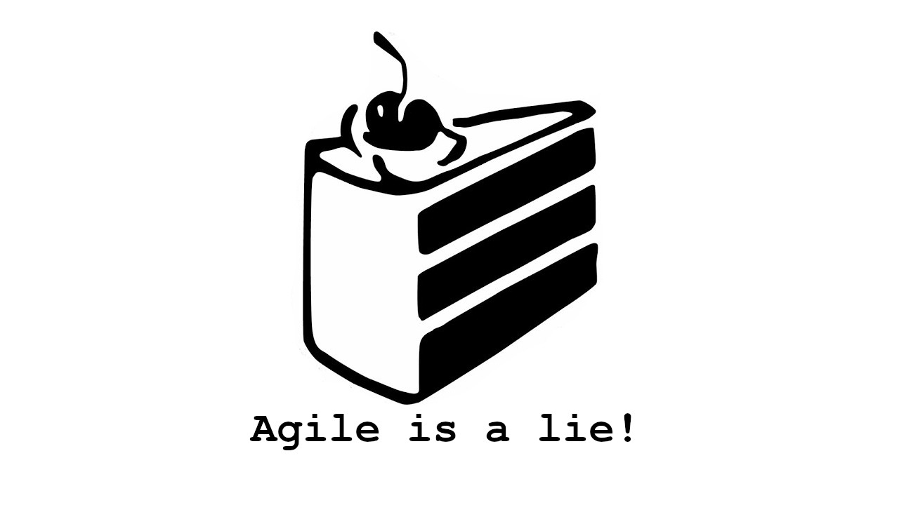

# Way to the cake: the Agile is a Lie learning path
This is the "Agile is a Lie" team's learning path.
This path will give you the resources to take you from having a basic knowledge in agile principles to master them.

Freely inspired by [Starway-to-orione](https://github.com/xpeppers/starway-to-orione) thank you @xpeppers.

## Change Agent
You wanna be a "change agent"? Then this is the best way to start.  
Do you consider yourself a "change agent"? Then you might want to make sure you learned some lessons.
* 🇬🇧🎥[Confession of a Change Agent Henrik Kniberg](https://www.youtube.com/watch?v=c1W6U2duXdI&ab_channel=ScrumUkraine)

## Agile
* 🇬🇧📃Of course the [Agile Manifesto](https://agilemanifesto.org/) ```#onboarding```
  * 🇬🇧📃And the [Principles behind the Agile Manifesto](https://agilemanifesto.org/principles.html) ```#onboarding```

## Learning Path
We support continuous learning through our [learning path](learning-path.md)

## Scrum
* 🇬🇧📃The official [Scrum guide](https://www.scrumguides.org/scrum-guide.html) ```#onboarding```
* 🇬🇧📃Everything you should learn about [retrospective](https://retromat.org/blog/getting-started-with-retrospectives/) ```#onboarding```
* 🇬🇧📃About [sprint review](https://medium.com/@anca_51481/12-things-you-must-know-about-the-sprint-review-e57cfea4da3d) ```#onboarding```
* 🇬🇧📃The importance to have the [real customer](https://medium.com/serious-scrum/scrum-teams-need-to-know-their-real-customers-ec52cf71c717) at the sprint review
* 🇬🇧📃[How to succeed with Zombie Scrum](https://medium.com/the-liberators/how-to-succeed-with-zombie-scrum-aa0444f806e5) A sarcastic list of tricks to improve your Zombie Scrum
* 🇬🇧🎥Scaling Agile with Large-Scale Scrum (LeSS) [Craig Larman Keynote video at Ericsonn](https://www.youtube.com/watch?v=Gw1lLt18KzE&ab_channel=CraigLarman)
* 🇬🇧📃[Feature Teams](https://less.works/less/structure/feature-teams) vs Component Teams (LeSS)

## Scrum Master
* 🇬🇧📃[70 theses](https://age-of-product.com/70-scrum-master-theses/) about Scrum Master that describe your role. ```#onboarding```
* 🇬🇧🎥[Host Leadership](https://vimeo.com/422134332) meetup with Pierluigi Pugliese ```#onboarding```
* 🇮🇹🎥[Myths about Scrum Master](https://vimeo.com/414450263) meetup with Pierluigi Pugliese   ```#onboarding```
* 🇬🇧📃[Inspiration & plan for Agile retrospective](https://retromat.org/en/)
* 🇬🇧📃[Shu-Ha-Ri](https://www.scrum.org/resources/blog/shu-ha-ri-professional-coaching) methodology inspired by Aikido masters to teach how to be agile at the scrum team.
* 🇬🇧📃[Full-time Scrum Master](https://scrummasterchecklist.org/pdf/ScrumMaster_Checklist_12_unbranded.pdf) a daily TODO list for scrum masters.
* 🇬🇧📃[Three mistakes Scrum Master usually do](https://www.mountaingoatsoftware.com/blog/three-mistakes-scrum-masters-make-and-how-to-correct-them) and how to fix them.
* 🇮🇹🎥[Gli schiacciatori NON parlano dell'alzata, la risolvono](https://www.youtube.com/watch?v=5RXX-PiifXY)

## User Stories
* 🇬🇧📃[Essential XP: Card, Conversation, Confirmation](https://ronjeffries.com/xprog/articles/expcardconversationconfirmation/) The essence of a User Story and Acceptance Test ```#onboarding```
* 🇮🇹🎥Where to start and how to split development in User Stories: [Responsive design and analysis XP](https://www.youtube.com/watch?v=4L9aL_W-Uo0) by Matteo Vaccari

## Books
* [Large-Scale Scrum: More with LeSS](https://www.amazon.it/Large-Scale-Scrum-More-Less-Signature/dp/0321985710)
* [Agile Retrospectives: Making Good Teams Great](https://www.amazon.it/gp/product/0977616649/)
* [Drive: The Surprising Truth About What Motivates Us](https://www.amazon.it/Drive-Surprising-Truth-About-Motivates/dp/1594484805)
* [Nonviolent Communication: A Language of Life](https://www.amazon.it/gp/product/189200528X)
